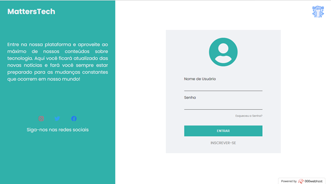
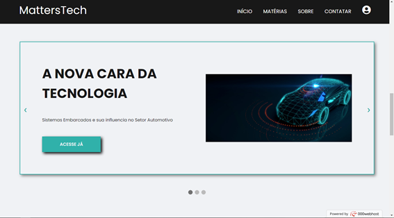
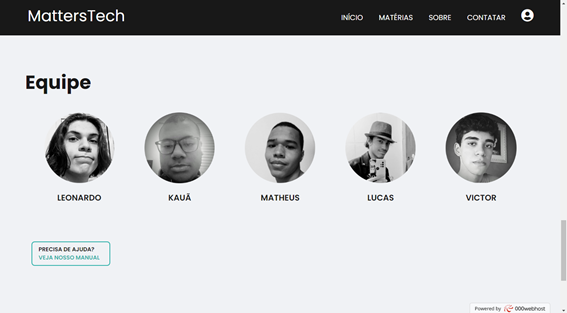
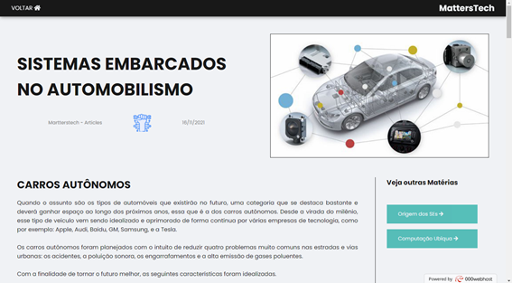
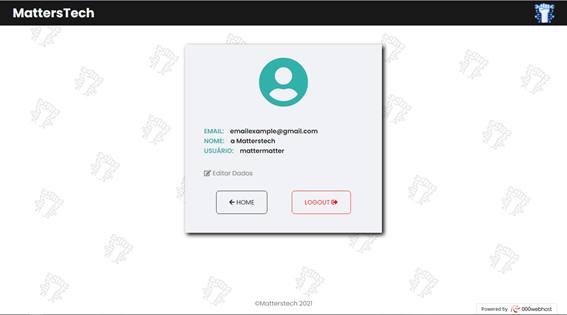

# MATTERSTECH - WEBSITE

<a href="https://www.php.net/" target="blank"></a>
<a href="https://www.mysql.com/" target="blank"></a>
<a href="https://developer.mozilla.org/pt-BR/docs/Web/HTML" target="blank"></a>
<a href="https://developer.mozilla.org/pt-BR/docs/Web/CSS" target="blank"></a>
<a href="https://developer.mozilla.org/pt-BR/docs/Web/JavaScript" target="blank"></a>

Esse projeto foi produzido com intuito de prática e aprendizado, além da realização do projeto de fim de ano da Etec de Carapicuíba. O sistema foi feito com PHP e MySQL, além de algumas outras tecnologias extras especificadas no fim desse arquivo. Se você quiser acessar e se inscrever, basta clicar [aqui](https://matterstech.000webhostapp.com/home.php). O site tem um sistema de:

- Login
- Registro
- Recuperação de Senha via E-mail (PHPMailer)
- Edição de Dados
- Comentários via Plugging do Facebook independente para cada artigo

Esse projeto Interdisciplinar foi apresentado no 2° Ano do curso de Desenvolvimento de Sistemas da Etec de Carapicuíba no dia 29/11/2021 do período entre 14:00 as 18:00 junto com os demais trabalhos escolares de colegas de classe. Nele falamos sobre Sistemas Embarcados no Setor Automotivo, seguindo a webquest produzida pelo nosso coordenador Wesley, onde especificava os requisitos e materiais a ser entregues.

<h2>Status do Projeto</h2>

<h4> 🚀 Finalizado! v1.0 🚀 </h4>

<h2>Pré-requisitos</h2>

<p>Para executar essa projeto será necessário baixar o xampp e fazer algumas pré configurações que serão citadas no tópico `Como usar` logo depois de `Demonstração`. Se quiser modificar o código será necessário um editor de códigos de sua preferência. Recomendo usar o <a href="https://code.visualstudio.com/download" alt="VS Code">Visual Studio Code</a>.</p>

<h2>Demonstração</h2>

- Login

  

- Home

  

- Início

  

- Artigos

  

- Equipe

  

- Sistemas Embarcados no Setor Automotivo

  

- Dados

  

<h2>Como usar</h2>

Esse projeto está hospedado na 000webhost, um site que possibilita a hospedagem de páginas PHP com MySQL entre outras tecnologias de forma gratuita e acessível (Clique [aqui](https://matterstech.000webhostapp.com/home.php) para abrir a página em seu navegador). Se você quiser testar em sua máquina basta baixar ele através do botão CODE em verde do lado do repositório e em seguida escolher Download ZIP que os arquivos iram para sua área de download.Após extrair a pasta do projeto para sua área de trabalho basta jogá-la para dentro da pasta c:/xampp/htdocs/websites/Inter/. Provavelmente você terá apenas o c:/xampp/htdocs/ após a instalação do xampp em sua máquina. Por tanto cria a pasta `websites` e a pasta `Inter`. Feito isso jogue todos os arquivos e pastas do projeto pra dentro de `Inter` e abra `localhost/websites/Inter` em seu navegador de preferência.

- Caso o projeto não rode a função de Enviar E-mail, tente reinstalar (usando Linux) as dependencias do phpmailer com:

```
$ composer require phpmailer/phpmailer
```

Caso esteja usando Windows ou outro sistema operacional, visite o site oficial deles clicando [aqui](https://packagist.org/packages/phpmailer/phpmailer)


### 🛠 Tecnologias

As seguintes ferramentas foram usadas na construção do projeto:

- [PHP](https://www.php.net/)

- [MySQL](https://www.mysql.com/)

- [HTML](https://developer.mozilla.org/pt-BR/docs/Web/HTML)

- [CSS](https://developer.mozilla.org/pt-BR/docs/Web/CSS)

- [JavaScript](https://developer.mozilla.org/pt-BR/docs/Web/JavaScript)

- [Google Fonts Poppins](https://fonts.google.com/specimen/Poppins?query=Popp)

- [Font Awesome Icons](https://fontawesome.com)

### PACKAGES

- [PHPMailer](https://github.com/PHPMailer/PHPMailer)

### EDITORES

- [Visual Studio Code](https://code.visualstudio.com/)

- [Xampp](https://www.apachefriends.org/pt_br/index.html)

## 💪 Como contribuir para o projeto

1. Faça um **fork** do projeto.

2. Crie uma nova branch com as suas alterações: `git checkout -b my-feature`

3. Salve as alterações e crie uma mensagem de commit contando o que você fez: `git commit -m "feature: My new feature"`

4. Envie as suas alterações: `git push origin my-feature`

> Caso tenha alguma dúvida confira este [guia de como contribuir no GitHub](./CONTRIBUTING.md)

---

### Autores

<div>


<sub><b>Victor Hugo</b></sub>🚀

</div>
<div>


<sub><b>Leonardo Paschoa</b></sub>🚀

</div>
<div>


<sub><b>Kauã</b></sub>🚀

</div>
<div>


<sub><b>Lucas</b></sub>🚀

</div>
<div>


<sub><b>Matheus Gomes</b></sub>🚀

</div>

## 📝 Licença

Este projeto esta sobe a licença [MIT](./LICENSE).

Feito com dedicação por VictorSilva15, LeonardoPaschoaBraga16,  MatheusSilvaGomesEtec, kau-a, Lucas-Passos-Silva

---
